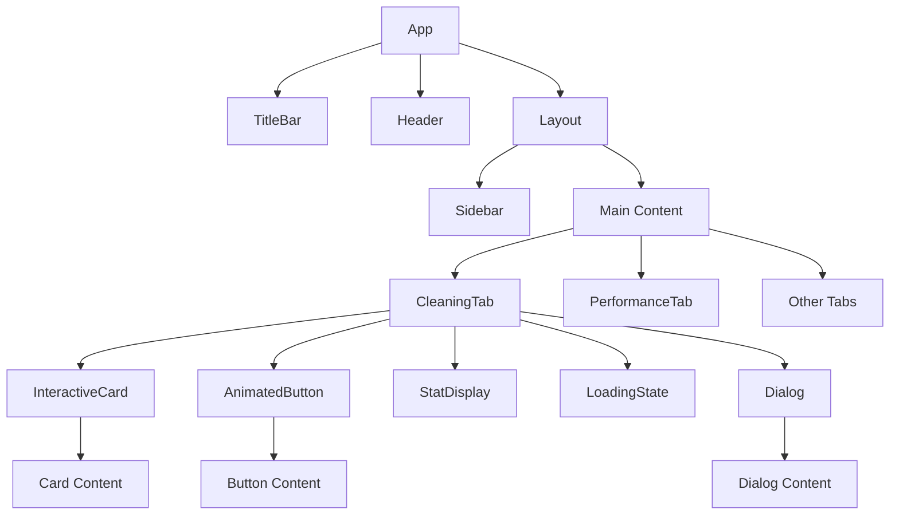
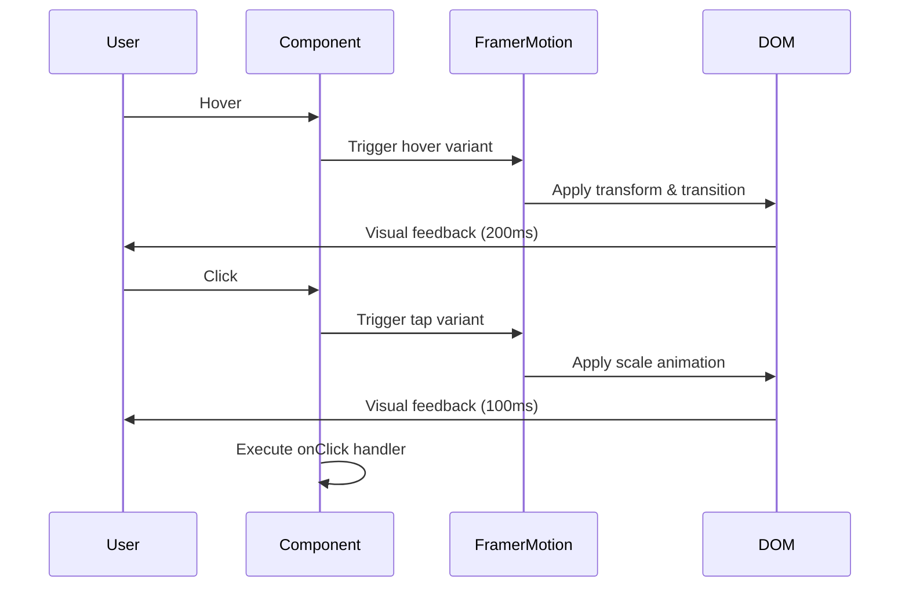
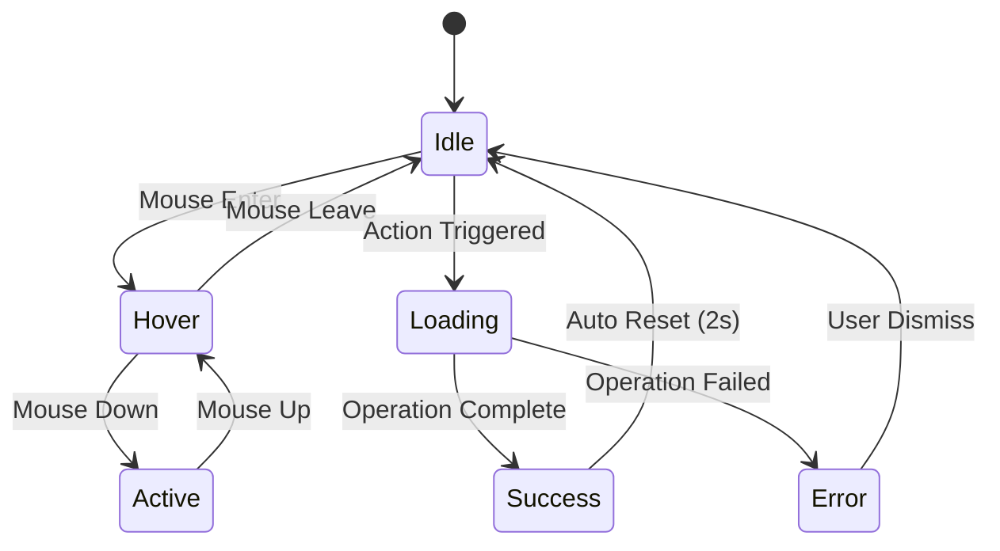

# Design Document - Modern UI Refactor

## Overview

Esta refatoração transforma o Windows Booster em uma aplicação moderna e interativa, mantendo a arquitetura Tauri + React existente. O foco está em melhorar a experiência visual através de um design system consistente, animações fluidas, micro-interações e uma paleta de cores neutras escuras profissionais.

A abordagem será incremental, atualizando componentes existentes e criando novos componentes reutilizáveis que seguem princípios de design modernos.

## Architecture

### Design System Structure

```
src/
├── styles/
│   ├── design-tokens.css      # Variáveis CSS para cores, espaçamentos, etc
│   └── animations.css          # Animações reutilizáveis
├── components/
│   ├── ui/                     # Componentes base (já existentes)
│   │   ├── button.tsx
│   │   ├── card.tsx
│   │   ├── progress.tsx
│   │   └── ...
│   └── enhanced/               # Componentes aprimorados
│       ├── InteractiveCard.tsx
│       ├── AnimatedButton.tsx
│       ├── StatDisplay.tsx
│       └── LoadingState.tsx
└── hooks/
    └── useHoverAnimation.ts    # Hook customizado para animações
```

### Technology Stack

- **React 19** - Framework UI
- **Framer Motion 12** - Animações e transições (já instalado)
- **Tailwind CSS 4** - Estilização utility-first (já configurado)
- **Lucide React** - Ícones modernos (já instalado)
- **Tauri 2** - Backend nativo

## Components and Interfaces

### 1. Design Tokens (CSS Variables)

Criar um sistema de tokens centralizado para manter consistência:

```css
:root {
  /* Colors - Neutral Dark Palette */
  --color-bg-primary: #0a0a0a;
  --color-bg-secondary: #0f0f0f;
  --color-bg-tertiary: #141414;
  --color-bg-elevated: #1a1a1a;
  
  --color-border-subtle: #1a1a1a;
  --color-border-default: #1f1f1f;
  --color-border-hover: #2a2a2a;
  
  --color-text-primary: #e5e5e5;
  --color-text-secondary: #a3a3a3;
  --color-text-tertiary: #737373;
  --color-text-disabled: #525252;
  
  --color-accent-primary: #f5f5f5;
  --color-accent-hover: #ffffff;
  
  --color-success: #22c55e;
  --color-error: #ef4444;
  --color-warning: #f59e0b;
  
  /* Spacing */
  --spacing-xs: 8px;
  --spacing-sm: 12px;
  --spacing-md: 16px;
  --spacing-lg: 24px;
  --spacing-xl: 32px;
  
  /* Border Radius */
  --radius-sm: 6px;
  --radius-md: 8px;
  --radius-lg: 12px;
  --radius-xl: 16px;
  
  /* Transitions */
  --transition-fast: 150ms;
  --transition-base: 200ms;
  --transition-slow: 300ms;
  
  /* Shadows */
  --shadow-sm: 0 1px 2px 0 rgb(0 0 0 / 0.05);
  --shadow-md: 0 4px 6px -1px rgb(0 0 0 / 0.1);
  --shadow-lg: 0 10px 15px -3px rgb(0 0 0 / 0.15);
  
  /* Typography */
  --font-size-xs: 12px;
  --font-size-sm: 14px;
  --font-size-base: 16px;
  --font-size-lg: 18px;
  --font-size-xl: 20px;
  --font-size-2xl: 24px;
}
```

### 2. InteractiveCard Component

Componente de card aprimorado com animações e estados hover:

```typescript
interface InteractiveCardProps {
  children: React.ReactNode;
  className?: string;
  onClick?: () => void;
  disabled?: boolean;
  hoverable?: boolean;
}

// Features:
// - Hover elevation animation
// - Border color transition
// - Optional click handler
// - Disabled state
// - Subtle shadow on hover
```

**Animações:**
- Hover: translateY(-2px) + border color change (200ms)
- Click: scale(0.98) (100ms)
- Shadow: opacity 0 → 0.1 (200ms)

### 3. AnimatedButton Component

Botão com estados visuais aprimorados:

```typescript
interface AnimatedButtonProps {
  children: React.ReactNode;
  variant?: 'primary' | 'secondary' | 'outline' | 'ghost';
  size?: 'sm' | 'md' | 'lg';
  loading?: boolean;
  disabled?: boolean;
  icon?: React.ReactNode;
  onClick?: () => void;
}

// Features:
// - Loading state com spinner
// - Hover brightness increase
// - Click scale animation
// - Icon support
// - Multiple variants
```

**Estados:**
- Default: bg-[#f5f5f5], text-[#0a0a0a]
- Hover: brightness(1.1), transition 150ms
- Active: scale(0.98)
- Loading: spinner + disabled
- Disabled: opacity 50%, cursor not-allowed

### 4. StatDisplay Component

Componente para exibir estatísticas e números importantes:

```typescript
interface StatDisplayProps {
  label: string;
  value: string | number;
  unit?: string;
  trend?: 'up' | 'down' | 'neutral';
  size?: 'sm' | 'md' | 'lg';
  mono?: boolean;
}

// Features:
// - Tipografia monospace para números
// - Trend indicators (opcional)
// - Tamanhos responsivos
// - Animação de contagem (opcional)
```

**Estilo:**
- Label: text-[#737373], font-size 14px
- Value: text-[#e5e5e5], font-size 20-24px, font-weight 600
- Mono: font-family monospace
- Trend icons: ↑ (green) ↓ (red) → (neutral)

### 5. LoadingState Component

Estados de loading consistentes:

```typescript
interface LoadingStateProps {
  type?: 'spinner' | 'skeleton' | 'progress';
  message?: string;
  progress?: number;
  size?: 'sm' | 'md' | 'lg';
}

// Features:
// - Spinner animado
// - Skeleton loaders
// - Progress bar
// - Mensagem opcional
```

**Variantes:**
- Spinner: Rotação contínua 360deg, 1s linear infinite
- Skeleton: Pulse animation, bg-[#1a1a1a]
- Progress: Barra com animação de preenchimento

### 6. Enhanced Sidebar

Melhorias na sidebar existente:

```typescript
// Adicionar ao TabButton existente:
// - Active indicator (barra lateral 3px)
// - Hover background transition
// - Icon + label spacing otimizado
// - Ripple effect no click (opcional)
```

**Estilo Active:**
- Background: #1f1f1f
- Border-left: 3px solid #f5f5f5
- Icon color: #f5f5f5
- Text color: #e5e5e5

**Estilo Hover:**
- Background: #1a1a1a
- Transition: 150ms ease

### 7. Enhanced Dialog/Modal

Melhorias nos dialogs existentes:

```typescript
// Adicionar animações ao Dialog do shadcn:
// - Scale-in animation (95% → 100%)
// - Backdrop blur
// - Smooth transitions
```

**Animações:**
- Enter: scale(0.95) → scale(1), opacity 0 → 1 (250ms)
- Exit: scale(1) → scale(0.95), opacity 1 → 0 (200ms)
- Backdrop: opacity 0 → 0.8 (200ms), backdrop-blur(4px)

## Data Models

### Animation Variants (Framer Motion)

```typescript
// Card hover animation
export const cardVariants = {
  initial: { y: 0, boxShadow: '0 0 0 0 rgba(0,0,0,0)' },
  hover: { 
    y: -2, 
    boxShadow: '0 10px 15px -3px rgba(0,0,0,0.15)',
    transition: { duration: 0.2 }
  },
  tap: { 
    scale: 0.98,
    transition: { duration: 0.1 }
  }
};

// Page transition
export const pageVariants = {
  initial: { opacity: 0, y: 20 },
  animate: { 
    opacity: 1, 
    y: 0,
    transition: { duration: 0.3 }
  },
  exit: { 
    opacity: 0, 
    y: -20,
    transition: { duration: 0.2 }
  }
};

// Button loading
export const spinnerVariants = {
  animate: {
    rotate: 360,
    transition: {
      duration: 1,
      repeat: Infinity,
      ease: 'linear'
    }
  }
};

// Accordion expand
export const accordionVariants = {
  collapsed: { height: 0, opacity: 0 },
  expanded: { 
    height: 'auto', 
    opacity: 1,
    transition: { duration: 0.3 }
  }
};
```

### Theme Configuration

```typescript
interface ThemeConfig {
  colors: {
    background: {
      primary: string;
      secondary: string;
      tertiary: string;
      elevated: string;
    };
    border: {
      subtle: string;
      default: string;
      hover: string;
    };
    text: {
      primary: string;
      secondary: string;
      tertiary: string;
      disabled: string;
    };
    accent: {
      primary: string;
      hover: string;
    };
    status: {
      success: string;
      error: string;
      warning: string;
    };
  };
  spacing: Record<string, string>;
  radius: Record<string, string>;
  transitions: Record<string, string>;
}
```

## Error Handling

### Visual Error States

1. **Form Validation Errors**
   - Border color: #ef4444
   - Error message: text-[#ef4444], font-size 12px
   - Shake animation: translateX(-4px → 4px → 0) 400ms

2. **Operation Failures**
   - Toast notification com ícone de erro
   - Background: #1a1a1a, border-left: 4px solid #ef4444
   - Auto-dismiss após 5 segundos
   - Slide-in animation da direita

3. **Loading Failures**
   - Skeleton → Error state transition
   - Retry button com hover animation
   - Error icon com pulse animation

### Graceful Degradation

- Se Framer Motion falhar: fallback para CSS transitions
- Se ícones não carregarem: usar fallback text
- Animações respeitam `prefers-reduced-motion`

```typescript
const shouldReduceMotion = window.matchMedia(
  '(prefers-reduced-motion: reduce)'
).matches;

const transition = shouldReduceMotion 
  ? { duration: 0 } 
  : { duration: 0.3 };
```

## Testing Strategy

### Visual Regression Testing

1. **Component Screenshots**
   - Capturar estados: default, hover, active, disabled, loading
   - Usar Playwright para screenshots automatizados
   - Comparar com baseline images

2. **Interaction Testing**
   - Testar hover states
   - Testar click animations
   - Testar keyboard navigation
   - Testar focus states

### Performance Testing

1. **Animation Performance**
   - Medir FPS durante animações (target: 60fps)
   - Usar Chrome DevTools Performance tab
   - Verificar repaints e reflows

2. **Bundle Size**
   - Monitorar tamanho do bundle após adicionar animações
   - Target: < 50KB adicional
   - Code splitting para componentes pesados

### Accessibility Testing

1. **Keyboard Navigation**
   - Todos os elementos interativos acessíveis via Tab
   - Focus indicators visíveis (outline: 2px solid #f5f5f5)
   - Skip links para navegação rápida

2. **Screen Readers**
   - ARIA labels em todos os botões de ícone
   - Live regions para updates dinâmicos
   - Semantic HTML (button, nav, main, etc)

3. **Color Contrast**
   - Verificar contraste mínimo 4.5:1 (WCAG AA)
   - Texto primário (#e5e5e5) vs background (#0a0a0a): 14.7:1 ✓
   - Texto secundário (#a3a3a3) vs background: 7.2:1 ✓

### Manual Testing Checklist

- [ ] Hover animations são suaves em todos os cards
- [ ] Transições de página não causam flicker
- [ ] Loading states são claros e informativos
- [ ] Botões disabled têm visual claro
- [ ] Sidebar navigation é intuitiva
- [ ] Modals abrem/fecham suavemente
- [ ] Progress bars atualizam em tempo real
- [ ] Checkboxes têm animação de check
- [ ] Responsive em 1024px, 1280px, 1440px
- [ ] Dark theme é consistente em todos os componentes

## Implementation Notes

### Phase 1: Design Tokens & Base Styles
- Criar design-tokens.css
- Atualizar App.css com novas variáveis
- Configurar animações base

### Phase 2: Enhanced Components
- Criar InteractiveCard
- Criar AnimatedButton
- Criar StatDisplay
- Criar LoadingState

### Phase 3: Update Existing Components
- Atualizar Sidebar com active indicators
- Atualizar CleaningTab com novos componentes
- Atualizar Dialog com animações
- Atualizar Progress com transições

### Phase 4: Polish & Optimization
- Adicionar micro-interações
- Otimizar performance de animações
- Testar acessibilidade
- Ajustes finais de spacing e colors

### Migration Strategy

Manter compatibilidade com código existente:
- Novos componentes são opt-in
- Componentes antigos continuam funcionando
- Migração gradual tab por tab
- Começar com CleaningTab como piloto

## Design Decisions & Rationale

### Por que Framer Motion?
- Já está instalado no projeto
- API declarativa e fácil de usar
- Performance otimizada com GPU acceleration
- Suporte a gestures e drag

### Por que não usar biblioteca de componentes pronta?
- Manter controle total sobre o design
- Evitar bloat de código não utilizado
- Customização mais fácil
- Já temos shadcn/ui como base

### Por que CSS Variables ao invés de Tailwind config?
- Runtime theming mais fácil
- Melhor para debugging no DevTools
- Compatibilidade com CSS-in-JS se necessário
- Tailwind 4 tem melhor suporte a CSS variables

### Por que paleta neutra sem cores vibrantes?
- Profissionalismo e seriedade
- Menos distração visual
- Melhor para uso prolongado
- Destaque para informações importantes (success/error)

## Mermaid Diagrams

### Component Hierarchy



### Animation Flow



### State Management


